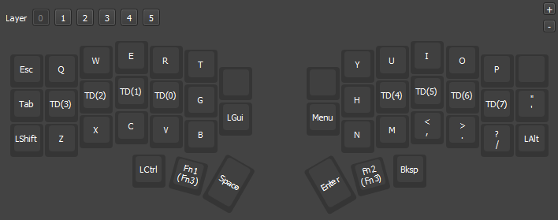
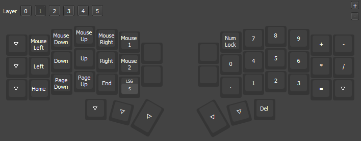
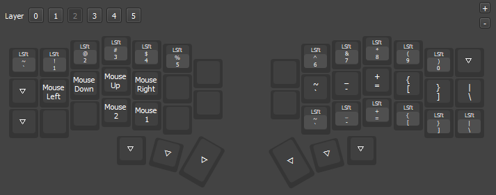
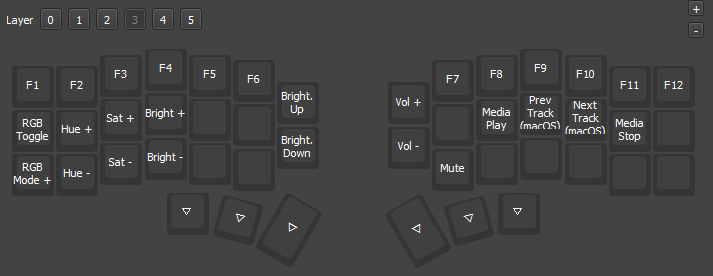

# My Corne Split Keyboard Layout 🧠⌨️

This repo contains my personal keymap and layer design for my Corne V4 split keyboard (42 keys), managed using [Vial](https://get.vial.today/).

## 🗂 Layout Overview

### 🔹 Base Layer (Layer 0)

### 🔸 Layer 1

### 🔸 Layer 2

### 🔸 Layer 3

## 📄 Keymap File

This layout is designed for use with [Vial](https://get.vial.today/), a powerful fork of VIA for real-time keymap editing and customization.

> **File**: [`layout.vil`](./layout.vil)

To load this layout:
1. Open Vial
2. Go to the `Design` tab (or use the Import option)
3. Load `layout.vil` to apply the layout to your keyboard

## 📸 Hardware

- **Keyboard**: Corne V4 (Split)
- **Switches**: Low Profile
- **Firmware**: Vial-compatible firmware

---

## 🧩 Tools Used

- [Vial](https://get.vial.today/) — Real-time keymap customization

---

## 🤝
